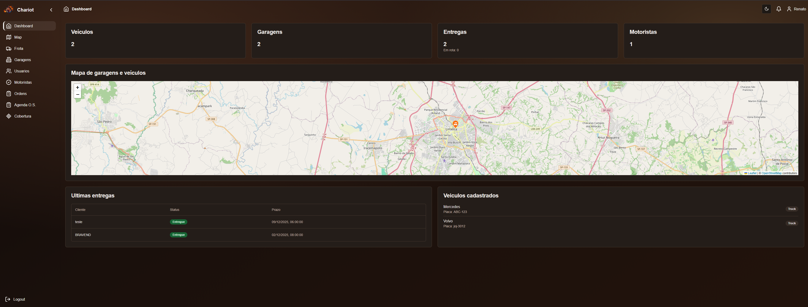
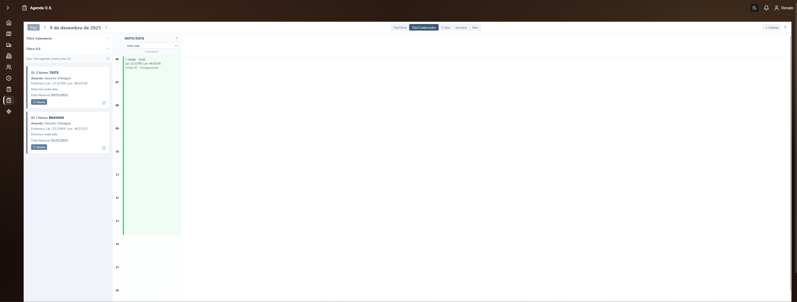

#  Chariot - Gestao de Rotas e Frota (open source)

Aplicacao open source para operar frota, motoristas e ordens de entrega com validacao geoespacial. Stack: Django 5 + DRF/PostGIS + Celery no backend e React/Vite/Tailwind + Leaflet no frontend.





> As imagens estao em `docs/`. Substitua pelos prints reais se preferir.

## Principais features
- Autenticacao JWT e protecao por perfil (admin, motorista).
- CRUD de veiculos (com foto, status e coordenadas), garagens e ordens de entrega.
- Areas de cobertura geoespaciais (centro+raio) e checagem de cobertura via CEP/lat/lon.
- Dashboard com contadores e mapa Leaflet de veiculos/garagens; mapa em tempo quase real.
- Agenda drag-and-drop de ordens por motorista/dia, com filtros e duracao ajustavel.
- Celery para notificacoes e simulacao de trafego (atualiza last_location).

## Como rodar (docker-compose)
1) Backend:  
```bash
cp .env.example .env
docker-compose up --build
```
Disponivel em `http://localhost:8000` (Swagger: `/api/schema/swagger-ui/`, admin opcional em `/admin`).

2) Frontend (opcional se nao usar o servico do compose):  
```bash
cd frontend
cp .env.example .env  # aponte VITE_API_URL para http://localhost:8000
npm install
npm run dev -- --host --port 5173
```

## Endpoints principais
- Auth: `POST /api/token/`, `POST /api/token/refresh/`
- Veiculos: `/api/vehicles/`
- Motoristas: `/api/drivers/`
- Ordens de entrega: `/api/delivery-orders/`
- Garagens: `/api/garages/`
- Cobertura: `POST /api/coverage-check/`
- Resumo dashboard: `GET /api/dashboard-summary/`
- Usuarios (admin): `/api/users/`
- CEP lookup: `/api/cep-lookup/`
- Docs: `/api/schema/swagger-ui/`

## Tarefas em background
- Worker Celery sobe no servico `celery`.
- Exemplo: `apps.logistics.tasks.add(2, 2)`.
- Notificacao: ao mudar `DeliveryOrder` para `in_transit`, dispara email (console).
- Simulacao de trafego: `docker-compose exec web python manage.py simulate_traffic`.

## Testes
Requer banco com extensao PostGIS:  
```bash
docker-compose run --rm web python manage.py test
```

## Contribuindo
- Crie um fork, abra uma branch (`feat/minha-feature`), envie PR com descricao curta.
- Mantenha README e exemplos de prints em `docs/`.

## Licenca
MIT (veja `LICENSE`).
